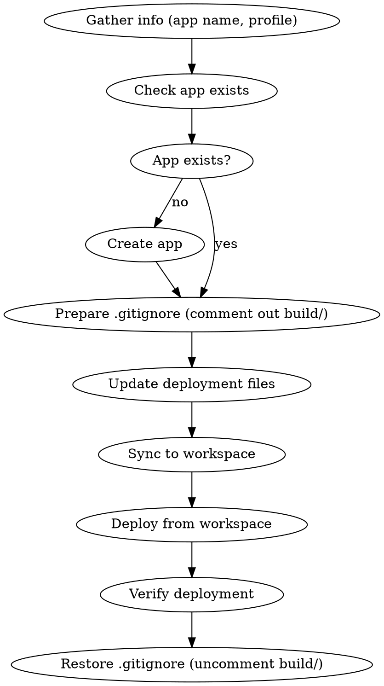

# Deploying BrickChat to Databricks Apps

## First: Gather Required Information

**Before proceeding, ask the user these questions using `AskUserQuestion`:**

1. **App Name**: "What is the name of your Databricks App?" (Default: `brickchat`)
2. **Databricks Profile**: "Which Databricks CLI profile should be used?" (e.g., `DEFAULT`, `9cefok`, or other configured profile)

Store responses as `<APP_NAME>` and `<PROFILE>` for use in all commands below.

**All `databricks` commands must include `--profile <PROFILE>`.**

## Second: Check if App Exists

**BEFORE any deployment steps, check if the app exists:**

```bash
databricks apps get <APP_NAME> --profile <PROFILE>
```

**If the app does NOT exist** (error: "does not exist or is deleted"):
1. Inform the user: "The app '<APP_NAME>' doesn't exist. I'll create it now."
2. Create the app:
   ```bash
   databricks apps create <APP_NAME> --description "BrickChat - AI Chat Application" --profile <PROFILE>
   ```
3. Wait for creation to complete before proceeding

**If the app EXISTS**: Proceed directly to deployment workflow.

## Overview

Deploy BrickChat (Flutter WASM frontend + FastAPI backend) to Databricks Apps. The deployment folder contains all files needed for a self-contained deployment.

## Prerequisites

- Databricks CLI installed and configured (`databricks auth login`)
- Flutter SDK installed
- Access to Databricks workspace with Apps enabled
- Environment secrets configured in Databricks (first deployment only)

## Deployment Workflow



## Step 1: Prepare .gitignore for Deployment

**CRITICAL:** The `build/` and `deployment/build/` folders must be tracked in git for workspace sync to work. Before deployment, temporarily modify `.gitignore`:

```bash
# Comment out build folders in .gitignore
sed -i '' 's/^build\/$/# build\//' .gitignore
sed -i '' 's/^deployment\/build\/$/# deployment\/build\//' .gitignore
```

**Verify the change:**
```bash
grep -E "^#?\s*build\/" .gitignore
# Should show: # build/
```

## Step 2: Update Deployment Files

**Option A: Use the update script**
```bash
cd deployment
./update_deployment.sh
```

**Option B: Manual steps**
```bash
# Build Flutter WASM
flutter build web --wasm

# Copy frontend (note: deployment expects build/, not build/web/)
rm -rf deployment/build
mkdir -p deployment/build
cp -r build/web/* deployment/build/

# Copy backend files
cp backend/app.py deployment/
cp backend/database.py deployment/
cp backend/auth.py deployment/
cp backend/routers/* deployment/routers/

# Update requirements
cd backend && uv pip freeze > ../deployment/requirements.txt
```

**IMPORTANT:** After copying `app.py`, verify build paths match:
- `deployment/app.py` should reference `build/` (not `build/web/`)
- `backend/app.py` references `build/web/` or `../build/web/`
- See Troubleshooting section if frontend doesn't load

## Step 3: Configure Secrets (First Deployment Only)

Secrets are referenced in `app.yaml` using `valueFrom`:

| Secret Name | Purpose |
|-------------|---------|
| `DATABRICKS_TOKEN` | API access token |
| `REPLICATE_API_TOKEN` | TTS via Replicate |
| `DEEPGRAM_API_TOKEN` | Speech-to-text |

Configure in Databricks workspace settings or via CLI.

## Step 4: Local Testing

```bash
cd deployment
cp .env.example .env  # Edit with your values
uv pip install -r requirements.txt
uv run uvicorn app:app --host 0.0.0.0 --port 8000
```

Verify at `http://localhost:8000`:
- Frontend loads correctly
- Health check: `curl http://localhost:8000/health`
- Chat functionality works

## Step 5: Sync to Databricks Workspace

**IMPORTANT:** The `databricks apps deploy` command requires a **workspace path**, not a local path. You must sync local files to the workspace first.

```bash
# Sync deployment folder to workspace (use --full for complete sync)
databricks sync ./deployment /Workspace/Users/<YOUR_EMAIL>/brickchat --profile <PROFILE> --full
```

Replace `<YOUR_EMAIL>` with the user's Databricks email (can be found from `databricks apps get` output under `creator` field).

## Step 6: Deploy from Workspace

```bash
# Deploy from the workspace path (NOT local path)
databricks apps deploy <APP_NAME> --source-code-path /Workspace/Users/<YOUR_EMAIL>/brickchat --profile <PROFILE>
```

**Common mistake:** Using `--source-code-path ./deployment` will fail with "must be a valid workspace path" error.

For subsequent updates:
1. Run the sync command again
2. Run the deploy command again

## Step 7: Verify Deployment

```bash
# Check app status
databricks apps get <APP_NAME> --profile <PROFILE>

# View logs (if needed)
databricks apps logs <APP_NAME> --profile <PROFILE>
```

**Success indicators:**
- `app_status.state`: `RUNNING`
- `compute_status.state`: `ACTIVE`
- `active_deployment.status.state`: `SUCCEEDED`
- `url`: The app URL will be displayed

## Step 8: Restore .gitignore

**CRITICAL:** After successful deployment, restore `.gitignore` to ignore build folders again:

```bash
# Uncomment build folders in .gitignore
sed -i '' 's/^# build\/$/build\//' .gitignore
sed -i '' 's/^# deployment\/build\/$/deployment\/build\//' .gitignore
```

**Verify the restore:**
```bash
grep -E "^build\/" .gitignore
# Should show: build/
```

This prevents accidental commits of large build artifacts to the repository.

## Quick Reference

| Task | Command |
|------|---------|
| Check app exists | `databricks apps get <APP_NAME> --profile <PROFILE>` |
| Create app (once) | `databricks apps create <APP_NAME> --description "BrickChat - AI Chat Application" --profile <PROFILE>` |
| Prepare .gitignore | `sed -i '' 's/^build\/$/# build\//' .gitignore && sed -i '' 's/^deployment\/build\/$/# deployment\/build\//' .gitignore` |
| Update deployment | `cd deployment && ./update_deployment.sh` |
| Local test | `cd deployment && uv run uvicorn app:app --host 0.0.0.0 --port 8000` |
| Sync to workspace | `databricks sync ./deployment /Workspace/Users/<EMAIL>/brickchat --profile <PROFILE> --full` |
| Deploy | `databricks apps deploy <APP_NAME> --source-code-path /Workspace/Users/<EMAIL>/brickchat --profile <PROFILE>` |
| Check status | `databricks apps get <APP_NAME> --profile <PROFILE>` |
| Restore .gitignore | `sed -i '' 's/^# build\/$/build\//' .gitignore && sed -i '' 's/^# deployment\/build\/$/deployment\/build\//' .gitignore` |
| View logs | `databricks apps logs <APP_NAME> --profile <PROFILE>` |
| Health check | `curl http://localhost:8000/health` |

## Troubleshooting

### "Source code path must be a valid workspace path" error
This happens when using a local path with `databricks apps deploy`. Solution:
1. First sync files to workspace: `databricks sync ./deployment /Workspace/Users/<EMAIL>/brickchat --profile <PROFILE> --full`
2. Then deploy from workspace path: `databricks apps deploy <APP_NAME> --source-code-path /Workspace/Users/<EMAIL>/brickchat --profile <PROFILE>`

### "App does not exist or is deleted" error
Create the app first:
```bash
databricks apps create <APP_NAME> --description "BrickChat - AI Chat Application" --profile <PROFILE>
```
Wait for creation to complete before deploying.

### App won't start
- Check logs: `databricks apps logs <APP_NAME> --profile <PROFILE>`
- Verify secrets are configured in Databricks workspace
- Ensure database is accessible from Databricks

### Frontend not loading
- Verify `deployment/build/` contains Flutter WASM files (including `index.html`)
- Check that `index.html` exists in build directory
- Rebuild: `flutter build web --wasm`

### Build path mismatch (common issue)
When copying `app.py` from `backend/` to `deployment/`, the build paths may differ:

| Location | Expected build path |
|----------|---------------------|
| `backend/app.py` | `build/web/` or `../build/web/` |
| `deployment/app.py` | `build/` (no `web/` subfolder) |

**After copying backend files, verify `deployment/app.py` uses correct paths:**
```python
# Deployment should check for build/ not build/web/
if os.path.exists("build/index.html"):  # Correct for deployment
```

**Use `/debug/info` endpoint to diagnose:**
```bash
curl http://localhost:8000/debug/info
```
This shows which paths exist and helps identify mismatches.

### API errors
- Check `DATABRICKS_TOKEN` and `DATABRICKS_BASE_URL` are correct
- Verify model endpoint is accessible
- Review logs for specific error messages

### CORS issues (local dev)
- Backend has CORS enabled for all origins in development
- For production, configure specific allowed origins

## Key Files

| File | Purpose |
|------|---------|
| `app.yaml` | Databricks Apps configuration |
| `app.py` | FastAPI entry point (uses `build/` path) |
| `requirements.txt` | Python dependencies |
| `build/` | Flutter WASM frontend (deployment) |
| `.env.example` | Environment template |
