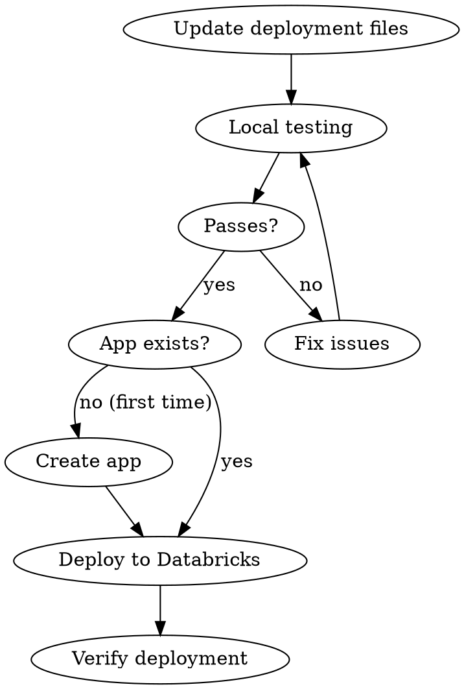

# Deploying BrickChat to Databricks Apps

## First: Get the App Name

**Before proceeding, ask the user:** "What is the name of your Databricks App?"

Store their response as `<APP_NAME>` and use it in all commands below. Default: `brickchat`

## Overview

Deploy BrickChat (Flutter WASM frontend + FastAPI backend) to Databricks Apps. The deployment folder contains all files needed for a self-contained deployment.

## Prerequisites

- Databricks CLI installed and configured (`databricks auth login`)
- Flutter SDK installed
- Access to Databricks workspace with Apps enabled
- Environment secrets configured in Databricks (first deployment only)

## Deployment Workflow



## Step 1: Update Deployment Files

**Option A: Use the update script**
```bash
cd deployment
./update_deployment.sh
```

**Option B: Manual steps**
```bash
# Build Flutter WASM
flutter build web --wasm

# Copy frontend (note: deployment expects build/, not build/web/)
rm -rf deployment/build
mkdir -p deployment/build
cp -r build/web/* deployment/build/

# Copy backend files
cp backend/app.py deployment/
cp backend/database.py deployment/
cp backend/auth.py deployment/
cp backend/routers/* deployment/routers/

# Update requirements
cd backend && uv pip freeze > ../deployment/requirements.txt
```

**IMPORTANT:** After copying `app.py`, verify build paths match:
- `deployment/app.py` should reference `build/` (not `build/web/`)
- `backend/app.py` references `build/web/` or `../build/web/`
- See Troubleshooting section if frontend doesn't load

## Step 2: Configure Secrets (First Deployment Only)

Secrets are referenced in `app.yaml` using `valueFrom`:

| Secret Name | Purpose |
|-------------|---------|
| `DATABRICKS_TOKEN` | API access token |
| `REPLICATE_API_TOKEN` | TTS via Replicate |
| `DEEPGRAM_API_TOKEN` | Speech-to-text |

Configure in Databricks workspace settings or via CLI.

## Step 3: Local Testing

```bash
cd deployment
cp .env.example .env  # Edit with your values
uv pip install -r requirements.txt
uv run uvicorn app:app --host 0.0.0.0 --port 8000
```

Verify at `http://localhost:8000`:
- Frontend loads correctly
- Health check: `curl http://localhost:8000/health`
- Chat functionality works

## Step 4: Create App (First Deployment Only)

Create the Databricks App in your workspace:

```bash
# Create the app (only needed once)
databricks apps create <APP_NAME> --description "BrickChat - AI Chat Application"
```

Alternatively, create via the Databricks UI:
1. Navigate to **Compute** > **Apps** in your workspace
2. Click **Create App**
3. Name it `<APP_NAME>` and configure settings

## Step 5: Deploy to Databricks

```bash
# Deploy code to the app
databricks apps deploy <APP_NAME> --source-code-path ./deployment
```

For subsequent updates, just run the deploy command again.

## Step 6: Verify Deployment

```bash
# Check app status
databricks apps get <APP_NAME>

# View logs
databricks apps logs <APP_NAME>
```

## Quick Reference

| Task | Command |
|------|---------|
| Update deployment | `cd deployment && ./update_deployment.sh` |
| Local test | `uv run uvicorn app:app --host 0.0.0.0 --port 8000` |
| Create app (once) | `databricks apps create <APP_NAME>` |
| Deploy | `databricks apps deploy <APP_NAME> --source-code-path ./deployment` |
| Check status | `databricks apps get <APP_NAME>` |
| View logs | `databricks apps logs <APP_NAME>` |
| Health check | `curl http://localhost:8000/health` |

## Troubleshooting

### App won't start
- Check logs: `databricks apps logs <APP_NAME>`
- Verify secrets are configured in Databricks workspace
- Ensure database is accessible from Databricks

### Frontend not loading
- Verify `deployment/build/` contains Flutter WASM files (including `index.html`)
- Check that `index.html` exists in build directory
- Rebuild: `flutter build web --wasm`

### Build path mismatch (common issue)
When copying `app.py` from `backend/` to `deployment/`, the build paths may differ:

| Location | Expected build path |
|----------|---------------------|
| `backend/app.py` | `build/web/` or `../build/web/` |
| `deployment/app.py` | `build/` (no `web/` subfolder) |

**After copying backend files, verify `deployment/app.py` uses correct paths:**
```python
# Deployment should check for build/ not build/web/
if os.path.exists("build/index.html"):  # Correct for deployment
```

**Use `/debug/info` endpoint to diagnose:**
```bash
curl http://localhost:8000/debug/info
```
This shows which paths exist and helps identify mismatches.

### API errors
- Check `DATABRICKS_TOKEN` and `DATABRICKS_BASE_URL` are correct
- Verify model endpoint is accessible
- Review logs for specific error messages

### CORS issues (local dev)
- Backend has CORS enabled for all origins in development
- For production, configure specific allowed origins

## Key Files

| File | Purpose |
|------|---------|
| `app.yaml` | Databricks Apps configuration |
| `app.py` | FastAPI entry point (uses `build/` path) |
| `requirements.txt` | Python dependencies |
| `build/` | Flutter WASM frontend (deployment) |
| `.env.example` | Environment template |
