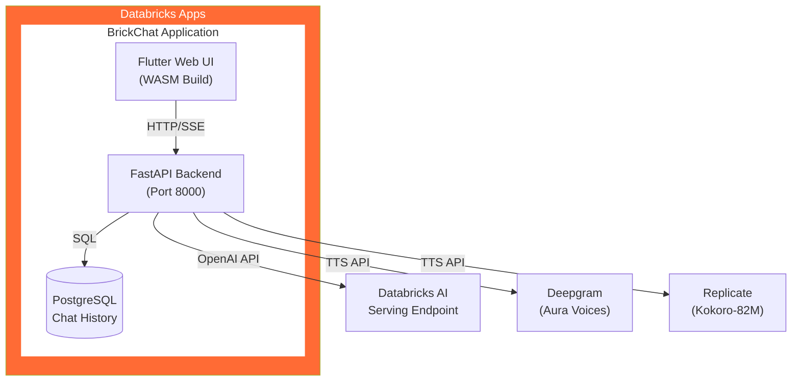
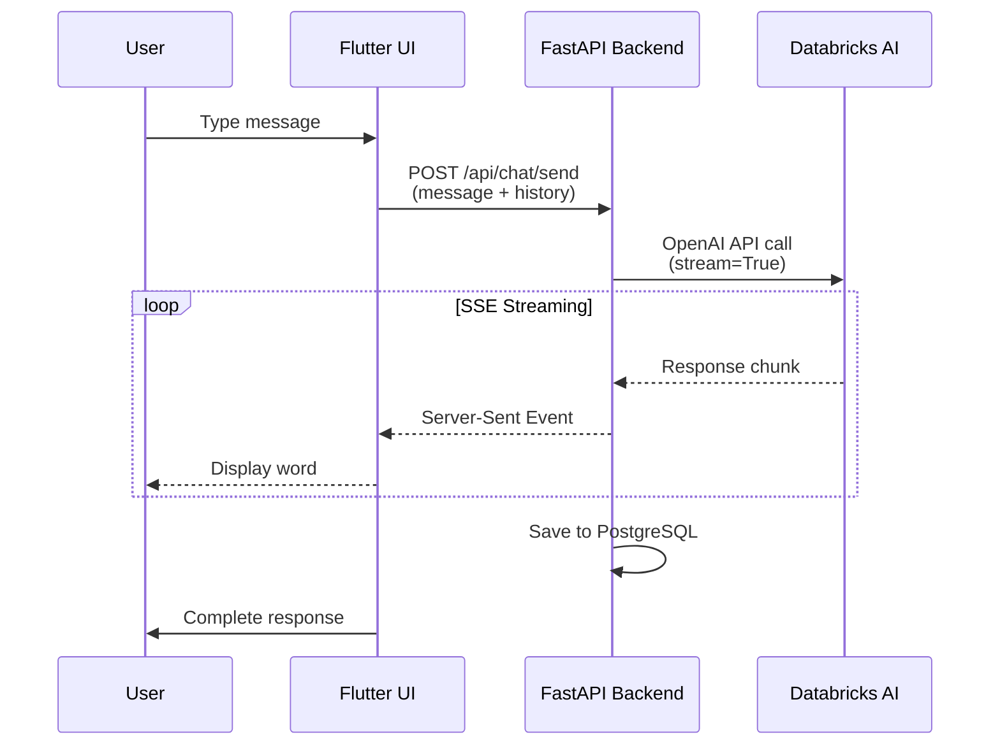
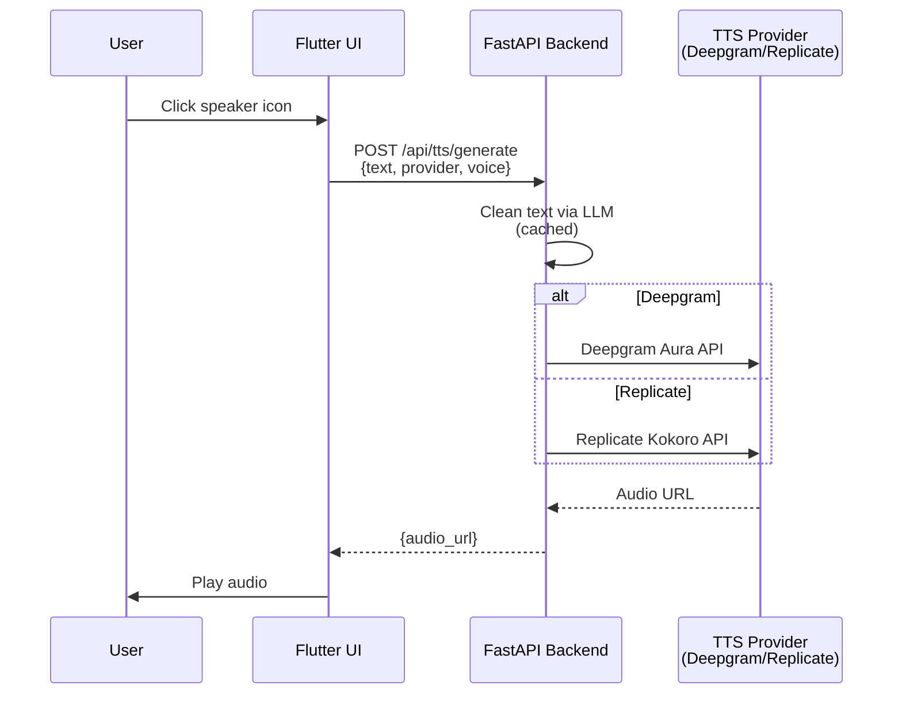
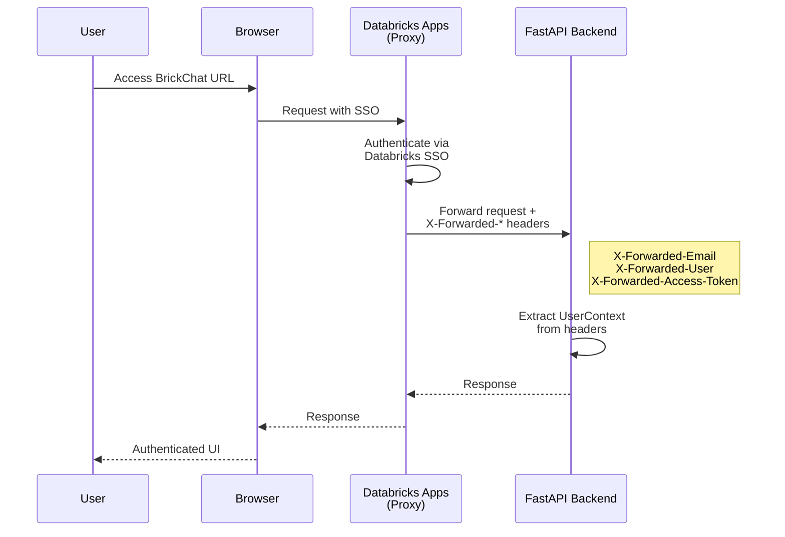

# BrickChat - Architecture Overview

## High-Level Architecture



<details>
<summary>ASCII Diagram (click to expand)</summary>

```
┌─────────────────────────────────────────────────────────────────────────┐
│                         DATABRICKS APPS                                  │
│  ┌───────────────────────────────────────────────────────────────────┐  │
│  │                     BrickChat Application                          │  │
│  │                                                                    │  │
│  │  ┌──────────────────┐         ┌──────────────────────────────┐   │  │
│  │  │  Flutter Web UI  │◄────────│   FastAPI Backend            │   │  │
│  │  │  (build/web/)    │  Static │   (app.py)                   │   │  │
│  │  │                  │  Files  │                               │   │  │
│  │  │  - Chat UI       │         │  Routes:                      │   │  │
│  │  │  - Chat History  │         │  ├─ /api/health              │   │  │
│  │  │  - Voice Input   │         │  ├─ /api/chat/send (SSE)     │   │  │
│  │  │  - Settings      │         │  ├─ /api/tts/generate        │   │  │
│  │  │  - TTS Player    │         │  └─ /api/feedback/*          │   │  │
│  │  └──────────────────┘         └──────────────┬───────────────┘   │  │
│  │         │                                     │                    │  │
│  │         │ HTTP/HTTPS                          │ SQL Queries        │  │
│  │         └─────────────────────────────────────┤                    │  │
│  │                                               │                    │  │
│  │                                  ┌────────────▼──────────────┐    │  │
│  │                                  │  PostgreSQL Database      │    │  │
│  │                                  │  - Chat threads           │    │  │
│  │                                  │  - Messages & history     │    │  │
│  │                                  │  - User feedback          │    │  │
│  │                                  └───────────────────────────┘    │  │
│  └───────────────────────────────────────────────────────────────────┘  │
└─────────────────────────────────────────────────────────────────────────┘
                                    │
                    ┌───────────────┼───────────────┐
                    │               │               │
                    ▼               ▼               ▼
        ┌─────────────────┐ ┌─────────────┐ ┌──────────────┐
        │  Databricks AI  │ │  Deepgram   │ │  Replicate   │
        │  Serving        │ │  TTS API    │ │  TTS API     │
        │  Endpoint       │ │             │ │  (Kokoro)    │
        │  (ka-4b190238)  │ │             │ │              │
        └─────────────────┘ └─────────────┘ └──────────────┘
```

</details>

## Component Breakdown

### 1. Frontend (Flutter Web - WASM)

```
lib/
├── main.dart                          # App entry point with Riverpod
├── core/
│   ├── constants/app_constants.dart   # Configuration & API endpoints
│   ├── services/
│   │   └── fastapi_service.dart       # Backend API client
│   └── theme/                         # Theme system (light/dark)
│       ├── app_theme.dart
│       ├── theme_provider.dart
│       └── app_colors.dart
├── features/
│   ├── chat/
│   │   └── presentation/
│   │       ├── chat_home_page.dart    # Main chat interface
│   │       └── chat_history_page.dart # Chat history & search
│   └── settings/
│       ├── presentation/
│       │   └── settings_page.dart     # Settings UI
│       └── providers/
│           └── settings_provider.dart # Settings state management
└── shared/
    └── widgets/
        ├── speech_to_text_widget.dart # Voice input
        └── theme_toggle.dart          # Theme switcher
```

**Key Features:**
- Material 3 design with custom Databricks branding
- Riverpod state management
- Real-time streaming chat responses
- Voice input (Speech-to-Text)
- TTS playback (Text-to-Speech)
- Theme persistence (SharedPreferences)
- Chat history with search functionality
- Continue conversations from history
- Message feedback (like/dislike)

### 2. Backend (FastAPI)

```
app.py                              # Main FastAPI application
├── CORS middleware                 # Allow cross-origin requests
├── WASM headers middleware         # Flutter WASM support
├── Static file serving             # Serve Flutter build/web
├── database.py                     # PostgreSQL database manager
└── API Routers:
    ├── routers/health.py           # Health check endpoint
    ├── routers/chat.py             # Chat with Databricks AI
    ├── routers/tts.py              # Text-to-Speech generation
    └── routers/feedback.py         # Feedback & thread management
```

**Key Features:**
- OpenAI-compatible API client for Databricks
- Server-Sent Events (SSE) for streaming responses
- Dual TTS provider support (Deepgram/Replicate)
- PostgreSQL database for chat persistence
- Thread-based conversation management
- Message feedback system (like/dislike)
- Environment-based configuration

### 3. External Services

#### Databricks AI Serving Endpoint
```
Endpoint: ka-4b190238-endpoint
Base URL: https://adb-984752964297111.11.azuredatabricks.net/serving-endpoints
Protocol: OpenAI-compatible API
Features: Chat completions with streaming
```

#### Deepgram TTS
```
Provider: Deepgram Aura
Voices: 13 options (Thalia, Asteria, Luna, etc.)
Format: MP3 audio
Speed: ~1-2 seconds
```

#### Replicate TTS
```
Provider: Kokoro-82M model
Voices: 18 options (Nicole, Bella, Adam, etc.)
Format: MP3 audio
Speed: <1 seconds
```

## Data Flow Diagrams

### Chat History & Search Flow

```
User opens history
   │
   ▼
┌─────────────────┐
│ Flutter UI      │
│ chat_history    │
│ _page.dart      │
└─────────────────┘
   │
   │ 1. GET /api/chat/threads?user_id=dev_user
   │
   ▼
┌─────────────────┐
│ FastAPI         │
│ routers/chat.py │
└─────────────────┘
   │
   │ 2. Query threads with last message
   │
   ▼
┌─────────────────┐
│ PostgreSQL      │
│ chat_threads    │
│ chat_messages   │
└─────────────────┘
   │
   │ 3. Return thread list with metadata
   │
   ▼
┌─────────────────┐
│ Flutter UI      │
│ Display threads │
│ + Search box    │
└─────────────────┘
   │
   │ User searches or selects thread
   │
   ▼
┌─────────────────┐
│ GET /api/       │
│ feedback/thread/│
│ {id}/messages   │
└─────────────────┘
   │
   │ 4. Load messages with feedback
   │
   ▼
┌─────────────────┐
│ Continue        │
│ conversation    │
│ in chat UI      │
└─────────────────┘
```

### Message Feedback Flow

```
User clicks like/dislike
   │
   ▼
┌─────────────────┐
│ Flutter UI      │
│ chat_home_page  │
└─────────────────┘
   │
   │ 1. PUT /api/feedback/feedback
   │    { message_id, thread_id, feedback_type }
   │
   ▼
┌─────────────────┐
│ FastAPI         │
│ routers/        │
│ feedback.py     │
└─────────────────┘
   │
   │ 2. UPSERT feedback
   │
   ▼
┌─────────────────┐
│ PostgreSQL      │
│ message_feedback│
└─────────────────┘
   │
   │ 3. Return updated feedback
   │
   ▼
┌─────────────────┐
│ Flutter UI      │
│ Update icon     │
│ state           │
└─────────────────┘
```

### Chat Message Flow (Streaming)



<details>
<summary>ASCII Diagram (click to expand)</summary>

```
User Input
   │
   ▼
┌─────────────────┐
│ Flutter UI      │
│ chat_home_page  │
└─────────────────┘
   │
   │ 1. Send message + conversation history
   │
   ▼
┌─────────────────┐
│ FastAPI         │
│ /api/chat/send  │
└─────────────────┘
   │
   │ 2. OpenAI client.chat.completions.create(stream=True)
   │
   ▼
┌──────────────────┐
│ Databricks       │
│ Serving Endpoint │
└──────────────────┘
   │
   │ 3. Stream response chunks (SSE)
   │
   ▼
┌─────────────────┐
│ FastAPI         │
│ yield chunks    │
└─────────────────┘
   │
   │ 4. Server-Sent Events
   │
   ▼
┌─────────────────┐
│ Flutter UI      │
│ Display message │
│ word-by-word    │
└─────────────────┘
```

</details>

### Text-to-Speech Flow



<details>
<summary>ASCII Diagram (click to expand)</summary>

```
User clicks speaker icon
   │
   ▼
┌─────────────────┐
│ Flutter UI      │
│ _playTextToSpeech │
└─────────────────┘
   │
   │ 1. POST /api/tts/generate
   │    { text, provider, voice }
   │
   ▼
┌─────────────────┐
│ FastAPI         │
│ routers/tts.py  │
└─────────────────┘
   │
   ├──────────────┬──────────────┐
   │              │              │
   ▼              ▼              │
┌───────────┐ ┌──────────┐      │
│ Deepgram  │ │ Replicate│      │
│ API       │ │ API      │      │
└───────────┘ └──────────┘      │
   │              │              │
   │ 2. Generate  │              │
   │    audio     │              │
   │              │              │
   └──────┬───────┘              │
          │                      │
          │ 3. Return audio URL  │
          │                      │
          ▼                      │
   ┌─────────────────┐           │
   │ FastAPI         │           │
   │ Return response │           │
   └─────────────────┘           │
          │                      │
          │ 4. { audio_url }     │
          │                      │
          ▼                      │
   ┌─────────────────┐           │
   │ Flutter UI      │           │
   │ Audio().play()  │◄──────────┘
   └─────────────────┘
```

</details>

### Voice Input Flow

```
User clicks microphone
   │
   ▼
┌─────────────────┐
│ Flutter UI      │
│ speech_to_text  │
│ _widget.dart    │
└─────────────────┘
   │
   │ 1. Request microphone permission
   │
   ▼
┌─────────────────┐
│ Browser API     │
│ getUserMedia()  │
└─────────────────┘
   │
   │ 2. Permission granted
   │
   ▼
┌─────────────────┐
│ speech_to_text  │
│ plugin          │
└─────────────────┘
   │
   │ 3. Listen & transcribe (on-device)
   │
   ▼
┌─────────────────┐
│ Flutter UI      │
│ onTextRecognized│
└─────────────────┘
   │
   │ 4. Send as chat message
   │
   ▼
(Continue with Chat Message Flow)
```

## State Management (Riverpod)

```
┌────────────────────────────────────────────────────┐
│              ProviderScope (main.dart)             │
└────────────────────────────────────────────────────┘
                        │
        ┌───────────────┼───────────────┐
        │               │               │
        ▼               ▼               ▼
┌──────────────┐ ┌─────────────┐ ┌──────────────┐
│ themeProvider│ │streamResults│ │ eagerMode    │
│              │ │Provider     │ │ Provider     │
│ (Theme mode) │ │ (Stream on) │ │ (Auto-TTS)   │
└──────────────┘ └─────────────┘ └──────────────┘
        │               │               │
        │               │               │
        ▼               ▼               ▼
┌──────────────┐ ┌─────────────┐ ┌──────────────┐
│SharedPrefs   │ │SharedPrefs  │ │SharedPrefs   │
│theme_mode    │ │stream_mode  │ │eager_mode    │
└──────────────┘ └─────────────┘ └──────────────┘
```

**Provider Types:**
- `StateNotifierProvider` - Mutable state with history
- `Provider` - Computed/derived values
- Extensions for convenient access (`ref.streamResults`)

## Security & Configuration

### Authentication Flow (Databricks Apps)



### Environment Variables (app.yaml)

```yaml
env:
  - name: DATABRICKS_TOKEN
    value: "{{secrets/brickchat-secrets/databricks-token}}"
  - name: DATABRICKS_BASE_URL
    value: "https://adb-984752964297111.11.azuredatabricks.net/serving-endpoints"
  - name: DATABRICKS_MODEL
    value: "ka-4b190238-endpoint"
  - name: DEEPGRAM_API_KEY
    value: "{{secrets/brickchat-secrets/deepgram-api-key}}"
  - name: REPLICATE_API_TOKEN
    value: "{{secrets/brickchat-secrets/replicate-api-token}}"
  - name: PGHOST
    value: "{{secrets/brickchat-secrets/pghost}}"
  - name: PGDATABASE
    value: "brickchat"
  - name: PGUSER
    value: "service_brickchat"
  - name: PG_PASS
    value: "{{secrets/brickchat-secrets/pg-pass}}"
  - name: PGPORT
    value: "5432"
```

### Secrets Management

```
Databricks Workspace
   │
   ▼
Secret Scope: brickchat-secrets
   ├── databricks-token
   ├── deepgram-api-key
   ├── replicate-api-token
   ├── pghost (PostgreSQL hostname)
   └── pg-pass (PostgreSQL password)
```

### Database Schema

```sql
-- Chat threads table
CREATE TABLE chat_threads (
    thread_id UUID PRIMARY KEY DEFAULT gen_random_uuid(),
    user_id VARCHAR(255) NOT NULL,
    created_at TIMESTAMP DEFAULT CURRENT_TIMESTAMP,
    updated_at TIMESTAMP DEFAULT CURRENT_TIMESTAMP,
    metadata JSONB DEFAULT '{}'::jsonb
);

-- Chat messages table
CREATE TABLE chat_messages (
    message_id UUID PRIMARY KEY DEFAULT gen_random_uuid(),
    thread_id UUID NOT NULL REFERENCES chat_threads(thread_id),
    user_id VARCHAR(255) NOT NULL,
    message_role VARCHAR(20) NOT NULL CHECK (message_role IN ('user', 'assistant', 'system')),
    message_content TEXT NOT NULL,
    created_at TIMESTAMP DEFAULT CURRENT_TIMESTAMP,
    metadata JSONB DEFAULT '{}'::jsonb
);

-- Message feedback table
CREATE TABLE message_feedback (
    feedback_id UUID PRIMARY KEY DEFAULT gen_random_uuid(),
    user_id VARCHAR(255) NOT NULL,
    message_id UUID NOT NULL REFERENCES chat_messages(message_id),
    thread_id UUID NOT NULL REFERENCES chat_threads(thread_id),
    feedback_type VARCHAR(20) NOT NULL CHECK (feedback_type IN ('like', 'dislike')),
    created_at TIMESTAMP DEFAULT CURRENT_TIMESTAMP,
    updated_at TIMESTAMP DEFAULT CURRENT_TIMESTAMP,
    UNIQUE (user_id, message_id, thread_id)
);

-- Indexes for performance
CREATE INDEX idx_threads_user_id ON chat_threads(user_id);
CREATE INDEX idx_messages_thread_id ON chat_messages(thread_id);
CREATE INDEX idx_feedback_message_id ON message_feedback(message_id);
```

## Deployment Architecture

```
┌─────────────────────────────────────────────────────────┐
│  Local Development                                       │
│  ┌────────────────┐         ┌─────────────────────┐    │
│  │ Flutter Dev    │         │ Backend Dev         │    │
│  │ flutter run    │         │ uv run python app.py│    │
│  │ localhost:XXXX │◄───────►│ localhost:8000      │    │
│  └────────────────┘         └─────────────────────┘    │
└─────────────────────────────────────────────────────────┘
                       │
                       │ ./deploy.sh
                       │
                       ▼
┌─────────────────────────────────────────────────────────┐
│  Databricks Apps Production                             │
│  ┌──────────────────────────────────────────────────┐  │
│  │  Single Unified App                               │  │
│  │  URL: /apps/brickchat                            │  │
│  │  ┌────────────┐  ┌────────────┐                 │  │
│  │  │ Flutter    │  │ FastAPI    │                 │  │
│  │  │ Static     │◄─┤ Backend    │                 │  │
│  │  │ Files      │  │ API        │                 │  │
│  │  └────────────┘  └────────────┘                 │  │
│  └──────────────────────────────────────────────────┘  │
└─────────────────────────────────────────────────────────┘
```

## Technology Stack

### Frontend
- **Framework**: Flutter 3.8.1+
- **Language**: Dart 3.8.1+
- **Build Target**: Web (WASM)
- **State Management**: Riverpod 2.6.1
- **UI**: Material 3 + flutter_chat_ui
- **Storage**: SharedPreferences
- **HTTP**: http package
- **Voice**: speech_to_text plugin

### Backend
- **Framework**: FastAPI 0.104.1+
- **Language**: Python 3.8+
- **Server**: Uvicorn
- **AI Client**: OpenAI SDK (Databricks-compatible)
- **TTS**: Deepgram SDK, Replicate SDK
- **Database**: PostgreSQL with psycopg2
- **Connection Pooling**: SimpleConnectionPool (1-20 connections)
- **Config**: python-dotenv

### Infrastructure
- **Platform**: Databricks Apps (Serverless)
- **Compute**: Auto-scaling serverless compute
- **Storage**: PostgreSQL database (persistent)
- **Secrets**: Databricks Secret Manager
- **Networking**: HTTPS with CORS support
- **Database**: Hosted PostgreSQL with SSL

## Performance Characteristics

### Response Times
- **Health Check**: < 100ms
- **Chat (Non-Streaming)**: 2-5 seconds
- **Chat (Streaming)**: First token ~500ms, complete ~3-5s
- **TTS (Deepgram)**: 1-2 seconds
- **TTS (Replicate)**: <1 seconds
- **Voice Input**: Real-time (on-device processing)

### Resource Usage
- **Flutter Build**: 31 MB total, 6.7 MB largest file
- **Backend Code**: 60 KB
- **Memory**: ~200-500 MB (estimated)
- **Bandwidth**: ~2-5 MB per session

## Scalability

```
User Load → Databricks Apps → Auto-scaling Serverless Compute
  │              │                       │
  1-10 users     └─► Single instance     │
  10-100 users       Multiple instances ─┘
  100+ users         Dynamic scaling
```

## Error Handling

### Frontend
- Network errors → User-friendly messages
- API timeouts → Retry mechanism
- Voice permission denied → Fallback to text input
- TTS failures → Silent failure with error log

### Backend
- Databricks API errors → 500 with error details
- Missing secrets → 503 Service Unavailable
- Invalid input → 400 Bad Request
- Rate limits → 429 Too Many Requests

---

**Architecture Version**: 1.1.0
**Last Updated**: January 2026
