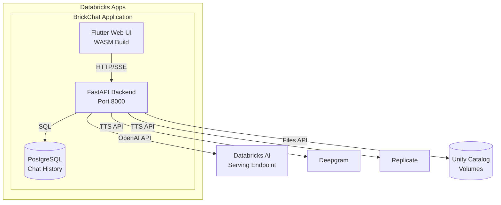

# BrickChat

A production-ready AI chat interface for Databricks serving endpoints. Deploy as a Databricks App with SSO authentication, persistent conversations, and enterprise features.

## Features

### AI Chat
- **Multi-threaded conversations** with full history and search
- **Real-time streaming responses** (word-by-word) with typing indicators
- **Reasoning display** with collapsible `<think>` sections for AI transparency
- **Citation extraction** with footnotes and expandable sources accordion
- **Message feedback** (like/dislike) with persistence
- **Copy to clipboard** for any message
- **Markdown rendering** with code syntax highlighting

### Voice & Audio
- **Speech-to-text input** with configurable keyboard shortcuts (Alt+V/A/M)
- **Text-to-Speech playback** with 30+ voice options
  - Deepgram Aura: 13 voices (Thalia, Asteria, Luna, Stella, Athena, Hera, Orion, Arcas, Perseus, Angus, Orpheus, Helios, Zeus)
  - Replicate Kokoro: 18+ voices (male and female variants)
- **Streaming audio** with play/pause/stop controls
- **Download audio files** for offline use
- **Eager mode** for automatic TTS playback after responses

### Document Intelligence (TalkToMyPDF)
- **Multi-file upload** supporting PDF and TXT formats
- **Unity Catalog volume storage** for secure, governed document management
- **Per-thread document management** with isolation per user
- **Chat with your documents** using multimodal AI (Claude Sonnet 4.5)
- **File limits**: 10MB per file, 10 files max per thread

### Theme & Design
- **Light / Dark / System themes** with automatic detection
- **Databricks-branded Material 3 design** system
- **Animated particle background** in dark mode (120 particles)
- **DM Sans typography** for clean, professional appearance
- **Responsive layout** optimized for desktop and web
- **Smooth theme transitions** (300ms animations)

### Enterprise Ready
- **On-behalf-of authentication** via Databricks Apps headers
- **PostgreSQL persistence** with connection pooling
- **User-isolated threads & documents** for data privacy
- **OpenAI-compatible Databricks endpoints** for flexible model deployment
- **Unity Catalog integration** for governed data access

### Developer Experience
- **Flutter Web (WASM)** for high-performance frontend
- **FastAPI backend** with async support
- **SSE streaming architecture** for real-time updates
- **Clean Architecture** with Riverpod state management
- **Full CORS & deployment support** for production environments

## Architecture



See [ARCHITECTURE.md](ARCHITECTURE.md) for detailed diagrams and data flows.

## Quick Start: Deploy to Databricks

### Prerequisites

- Databricks workspace with Apps enabled
- [Databricks CLI](https://docs.databricks.com/dev-tools/cli/index.html) installed and configured
- PostgreSQL database accessible from Databricks
- Flutter SDK 3.8.1+ installed

### Step 1: Configure Secrets

Create a secret scope and add required secrets:

```bash
# Create secret scope
databricks secrets create-scope brickchat-secrets

# Add secrets (you'll be prompted for values)
databricks secrets put-secret brickchat-secrets databricks-token
databricks secrets put-secret brickchat-secrets pghost
databricks secrets put-secret brickchat-secrets pg-pass
databricks secrets put-secret brickchat-secrets deepgram-api-key      # Optional: for TTS
databricks secrets put-secret brickchat-secrets replicate-api-token   # Optional: for TTS
```

### Step 2: Update Configuration

Edit `deployment/app.yaml` to match your environment:

```yaml
env:
  - name: DATABRICKS_MODEL
    value: "your-serving-endpoint-name"  # Update this
  - name: DATABRICKS_BASE_URL
    value: "https://your-workspace.cloud.databricks.com/serving-endpoints"  # Update this
```

### Step 3: Build and Deploy

```bash
# Build Flutter WASM
flutter build web --wasm

# Update deployment folder
./deployment/update_deployment.sh

# Deploy to Databricks Apps
databricks apps deploy brickchat --source-code-path ./deployment
```

### Step 4: Access Your App

After deployment completes, access BrickChat at:
```
https://your-workspace.cloud.databricks.com/apps/brickchat
```

## Quick Start: Local Development

### Backend

```bash
cd backend

# Create .env file from example
cp .env.example .env
# Edit .env with your credentials

# Install dependencies and run
uv pip install -r requirements.txt
uv run python app.py
```

Backend runs at `http://localhost:8000`

### Frontend (for UI development)

```bash
# Run Flutter in Chrome
flutter run -d chrome
```

For full-stack development, the backend serves the Flutter build at `http://localhost:8000`.

## Configuration

### Environment Variables

| Variable | Description | Required |
|----------|-------------|----------|
| `DATABRICKS_TOKEN` | Personal access token for Databricks API | Yes |
| `DATABRICKS_BASE_URL` | Serving endpoint base URL | Yes |
| `DATABRICKS_MODEL` | Model/endpoint name | Yes |
| `DATABRICKS_DOCUMENT_MODEL` | Model for document Q&A (default: `databricks-claude-sonnet-4-5`) | No |
| `DOCUMENTS_VOLUME_PATH` | Unity Catalog volume path for documents (e.g., `/Volumes/catalog/schema/volume`) | No |
| `PGHOST` | PostgreSQL hostname | Yes |
| `PGDATABASE` | Database name (default: `brickchat`) | Yes |
| `PGUSER` | Database username | Yes |
| `PG_PASS` | Database password | Yes |
| `PGPORT` | Database port (default: `5432`) | No |
| `DEEPGRAM_API_KEY` | Deepgram API key for TTS | No |
| `REPLICATE_API_TOKEN` | Replicate API token for TTS | No |

### Database Setup

Apply the schema to your PostgreSQL database:

```bash
psql -h $PGHOST -U $PGUSER -d $PGDATABASE -f deployment/schema.sql
```

See [deployment/postgres_setup.md](deployment/postgres_setup.md) for detailed setup instructions.

## Project Structure

```
brickchat/
├── lib/                    # Flutter frontend (Dart)
│   ├── core/              # Services, theme, constants
│   ├── features/          # Chat, settings pages
│   └── shared/            # Reusable widgets
├── backend/               # FastAPI backend (Python) - for development
│   ├── routers/           # API endpoints (chat, tts, feedback, documents)
│   ├── app.py             # Main application
│   ├── database.py        # PostgreSQL connection
│   └── document_service.py # Document storage and model API
├── deployment/            # Production deployment files
│   ├── app.yaml           # Databricks Apps config
│   ├── build/             # Flutter WASM build output
│   └── routers/           # API endpoints (production paths)
└── ARCHITECTURE.md        # Detailed architecture documentation
```

## Troubleshooting

See [deployment/TROUBLESHOOTING.md](deployment/TROUBLESHOOTING.md) for common issues and solutions.

## Support

For issues or feature requests, contact your Databricks administrator or open an issue in the repository.
